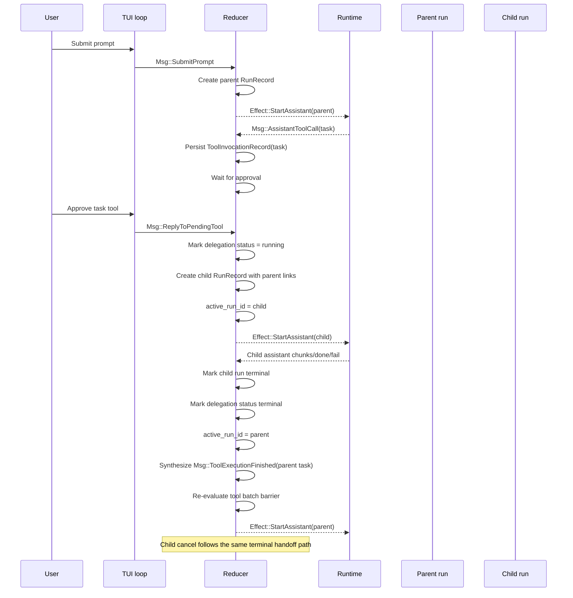

# OpenCode-Style Delegated Scheduling in This Repo

This document explains the delegated agent scheduling pattern borrowed from `anomalyco/opencode` and how it is now represented in this Rust codebase.

It is intentionally about the **implemented phase-1 plus startup-recovery shape**, not the full OpenCode server/session engine. The goal here is to preserve the same core orchestration behavior:

- the parent run emits a delegated task,
- the parent pauses,
- a real child run becomes foreground work,
- the child reaches a terminal state,
- the parent resumes from a durable synthetic task result.

Phase 2 adds one narrow restart behavior: if the app boots with exactly one well-formed delegated child still durably marked as running, startup reconciliation marks that child terminal with a restart-specific synthetic result and resumes the parent through the same durable `ToolExecutionFinished` path.

## The mental model

OpenCode treats subagents as real child sessions with their own lifecycle, not as an in-memory function call nested inside the parent transcript. This repo now mirrors that same scheduling idea with:

- a persisted **parent/child run lineage**,
- a persisted **task delegation lifecycle state** on the original task tool invocation,
- an ephemeral **foreground run pointer** (`active_run_id`), and
- a single parent resume path through synthetic `ToolExecutionFinished`.

The result is a reducer-owned scheduling flow, while the runtime remains a thin executor.

## Current implementation boundaries

### App-owned scheduling state

Scheduling lives in `fluent-code-app`, primarily in:

- `crates/fluent-code-app/src/app/update.rs`
- `crates/fluent-code-app/src/app/delegation.rs`
- `crates/fluent-code-app/src/session/model.rs`
- `crates/fluent-code-app/src/app/request_builder.rs`

The runtime in `crates/fluent-code-app/src/runtime/orchestrator.rs` does **not** decide scheduling. It only runs assistant streams and tool executions for a given `run_id`.

### Persisted state that carries the orchestration

The durable scheduling picture is split across two records:

1. `RunRecord`
   - owns execution lineage
   - records `parent_run_id`
   - records `parent_tool_invocation_id`

2. `ToolInvocationRecord.delegation`
   - records the child run id
   - records delegated agent/prompt
   - now records `TaskDelegationStatus`

`TaskDelegationStatus` is the explicit phase-1 scheduling state:

- `pending`
- `running`
- `completed`
- `failed`
- `cancelled`

This is the durable answer to “what is happening with the delegated subagent?” without introducing a separate scheduler subsystem.

### Ephemeral state that controls the foreground

`AppState.active_run_id` is still the foreground selector. It is not persisted. That means the repo now has durable lineage and durable delegated-task state, plus a one-shot startup reconciliation for a single interrupted delegated child, but it still does **not** promise full restart-and-recover execution ownership the way a larger workflow engine would.

That remains deliberate for phase 2.

## Sequence diagram

## Concrete message/effect flow

### 1. Parent prompt starts normally

`Msg::SubmitPrompt` creates a new parent run, appends the user turn, persists the run, sets `active_run_id`, and emits `Effect::StartAssistant`.

### 2. Parent emits a `task` tool call

`Msg::AssistantToolCall` creates a `ToolInvocationRecord` with:

- `run_id = parent_run_id`
- `tool_name = "task"`
- `preceding_turn_id = parent assistant turn`
- pending approval state

This matters because the delegated task still participates in the same batch barrier as any other tool call from that assistant turn.

### 3. Approval triggers delegated scheduling

When `Msg::ReplyToPendingTool` approves the task invocation, `start_child_run(...)`:

- parses the task request,
- looks up the target agent,
- creates a real child run,
- stores delegation metadata on the task invocation,
- sets delegation status to `running`,
- switches foreground to the child,
- appends the child user turn,
- starts a child assistant request with the child system prompt override.

### 4. Child requests stay isolated

`child_provider_request(...)` removes the `task` tool from child requests. That keeps phase 1 leaf-only and prevents recursive scheduling from invalidating the current single-foreground model.

### 5. Child terminal state resumes the parent

`complete_child_run(...)` handles child terminal outcomes:

- `Completed`
- `Failed`
- `Cancelled`

For all three, it:

- updates the child `RunRecord`
- updates `TaskDelegationStatus`
- switches foreground back to the parent
- synthesizes `Msg::ToolExecutionFinished` for the original parent `task` invocation

That synthetic tool result is what the parent replays back into the provider request.

## Why the synthetic tool result path matters

The parent is resumed through the same `ToolExecutionFinished` path used by normal tools. That preserves two important invariants already present in this repo:

1. **Batch semantics stay correct**
   - The parent resumes only when the whole tool batch for the same `preceding_turn_id` is terminal.

2. **Replay stays correct**
   - `build_provider_request(...)` replays the parent `task` call plus the synthetic tool result.
   - Child turns are not merged into parent history.

This is the closest local analogue to OpenCode’s “child session finishes, parent loop continues from a durable result.”

## Startup recovery for interrupted delegated children

Startup recovery stays app-owned. The TUI may trigger it once during boot, but the logic that inspects durable lineage, decides whether recovery is safe, terminalizes the child run, and resumes the parent lives in `fluent-code-app`.

The reconciliation is intentionally narrow:

- it only looks for the already-persisted delegated-child shape
- it requires exactly one candidate
- it fails closed on malformed or ambiguous lineage instead of guessing
- it marks the child `RunStatus::Failed`
- it marks the task delegation `TaskDelegationStatus::Failed`
- it uses the fixed synthetic result `Subagent interrupted by application restart before completion.`

The child's partial assistant text is **not** summarized during restart recovery. That avoids presenting incomplete child output as a finished result.

If another tool from the same parent batch is still nonterminal, the recovery still flows through `Msg::ToolExecutionFinished`, so the existing batch barrier keeps the parent paused instead of incorrectly restarting the assistant early.

## What changed from the earlier implementation

Before this port, the repo already had parent/child lineage and foreground handoff, but delegated-task state itself was implicit and child cancellation was a gap.

The phase-1 and phase-2 port added three concrete improvements:

### 1. Delegated-task lifecycle is now explicit

The task invocation itself now records whether the subagent is:

- running,
- completed,
- failed, or
- cancelled.

That makes the orchestration visible in persisted session state instead of inferring everything indirectly from run status alone.

### 2. Child cancellation is terminal, not stranding

Cancelling a foreground child now:

- cancels the child runtime work,
- marks the child run cancelled,
- marks the task delegation cancelled,
- synthesizes a parent tool result,
- resumes the parent cleanly.

That matches the core OpenCode scheduling expectation that delegated work should terminate into a durable parent-visible outcome.

### 3. Interrupted delegated children reconcile once at startup

If the previous process died while a delegated child was foregrounded, startup can now reconcile exactly one durable delegated-child lineage by:

- terminalizing the child as restart-interrupted
- terminalizing the delegation as failed
- synthesizing the fixed restart result back into the parent task invocation
- reusing the normal batch barrier and parent resume logic

### 4. Foreground ownership is now persisted narrowly

The session now persists a minimal foreground owner record for the currently active run. Startup uses it conservatively:

- root `generating` runs are restarted by rebuilding the root provider request
- `awaiting_tool_approval` state is restored without launching runtime work
- child `generating` still routes through the safer interrupted-child terminalization path
- generic `running_tool` startup still fails closed rather than guessing how to resume in-flight tool execution

## What this does not implement

This is not a full clone of OpenCode’s broader runtime model.

Phase 2 still does **not** implement:

- background sibling subagents
- recursive child delegation
- generic restart resumption for in-flight tool execution
- a global work queue or workflow engine
- server-owned multi-client session coordination

Those would require a larger scheduler/bootstrap design. For this repo, the current reducer-owned model is the minimal change that preserves existing batching, permissions, replay, and TUI assumptions.

## File map

- `crates/fluent-code-app/src/session/model.rs`
  - `TaskDelegationStatus`
  - `TaskDelegationRecord`
  - `ToolInvocationRecord` delegation helpers

- `crates/fluent-code-app/src/app/delegation.rs`
  - child start
  - child terminal handoff
  - parent synthetic resume

- `crates/fluent-code-app/src/app/update.rs`
  - approval flow
  - batch barrier handling
  - child cancel path

- `crates/fluent-code-app/src/app/request_builder.rs`
  - parent replay rules
  - child request isolation

- `crates/fluent-code-app/src/runtime/orchestrator.rs`
  - executor only

- `crates/fluent-code-tui/src/lib.rs`
  - integration tests covering foreground child swap and child cancel resume

## Recommended reading order

If you want to trace the full orchestration in code, read in this order:

1. `docs/opencode-delegated-scheduling.md` (this file)
2. [`opencode-vs-fluent-code-architecture.md`](opencode-vs-fluent-code-architecture.md)
3. [`opencode-workflow-report.md`](../opencode-workflow-report.md)
4. [`docs/agent-architecture-spec.md`](agent-architecture-spec.md)
5. `crates/fluent-code-app/src/app/update.rs`
6. `crates/fluent-code-app/src/app/delegation.rs`
7. `crates/fluent-code-app/src/app/request_builder.rs`
8. `crates/fluent-code-app/src/session/model.rs`

That path moves from the external model, to the local scheduling rules, to the concrete persisted structures that carry the orchestration.
